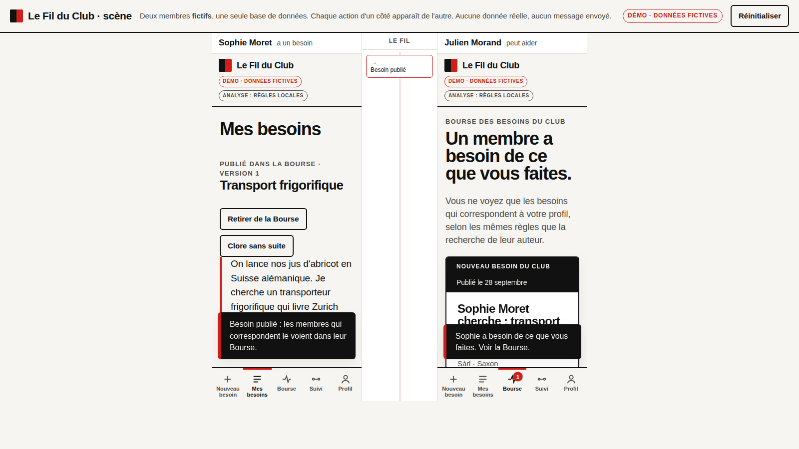

# Le Fil du Club : préparation Hack VS 2026

> **Prototype exploratoire préparé AVANT Hack VS** (Martigny, 3–4 octobre 2026), pour le challenge supposé
> « prolonger numériquement la communauté du Club des Affaires de la Foire du Valais ». Le brief officiel n'est pas encore connu.
> **Toutes les personnes et entreprises sont fictives.** Aucun message n'est envoyé.

**L'idée.** Un membre dit ce dont il a besoin. Le Club le fait parvenir **aux seuls membres capables d'y répondre**, avec la preuve de pourquoi
eux. Ceux-ci proposent leur aide ; la mise en relation se fait avec consentement. Et quand personne ne convient, le produit le dit, et
**le Club voit quelles compétences lui manquent : autant d'entreprises à inviter.**

Pages : `/` espace membre · `/scene` deux membres en direct · `/club` vue du Club · `/presentation` pitch hors ligne · `/rejoindre` QR.



## Lancer
```bash
cd prototype
pip install -r requirements-dev.txt   # (requirements.txt suffit pour lancer)
uvicorn app.main:app                  # http://localhost:8000
```
Ou avec Docker, depuis la racine : `docker build -t fil-du-club . && docker run -p 8080:8080 fil-du-club` (voir docs/DEPLOIEMENT.md).

| Variable | Effet |
|---|---|
| `HACKVS_MODE=demo` (défaut) / `reel` | `reel` : uniquement `HACKVS_PROFILS=<fichier autorisé>`, sans identité simulée ni journal exposé (503/501 sinon) |
| `HACKVS_LLM=claude` + `ANTHROPIC_API_KEY` | Analyse du besoin par Claude en flux, validée par le code ; repli affiché sur les règles |
| `HACKVS_CLAUDE_MODEL` | Modèle (défaut `claude-opus-5`) |
| `HACKVS_DB` | Fichier SQLite (défaut `prototype/var/`) |

## Vérifier
```bash
python -m pytest -q tests                  # 22 tests
python -m eval.run_eval                    # 4 jeux → eval/resultats_*.md
python scripts/parcours_demo.py [--video]  # parcours réel dans Chromium (serveur lancé) → docs/captures/ + 2 vidéos
python scripts/verifier_claude.py          # estimation, puis --confirmer pour exécuter contre l'API réelle
```

## État réel (28.09.2026, fin du lot 3)

| Fonctionne (vérifié) | Simulé / fictif | Non vérifié / manquant |
|---|---|---|
| Boucle complète : besoin → critères → clarification → publication (ou privé, anonyme possible) → Bourse du membre qui peut aider → proposition → acceptation → rencontre → clôture | 37 profils fictifs | **Claude jamais exécuté contre l'API réelle** (pas de clé ; testé avec un client simulé) |
| Vue scène : deux membres, une base, mises à jour en direct ; acte 2 « le Club se répare » | Les « autres humains » : on incarne tour à tour chaque membre (démo seulement) | Brief, règlement, critères du jury : inconnus |
| Vue du Club : compétences à recruter, offres à faire connaître, activité (calculées) ; profil en 30 secondes | Historique du Club (14 besoins inventés, chargé à la demande) | Aucune URL publique déployée (image Docker prête) |
| Retrait du consentement, refus, modification versionnée, clôture, résultats obsolètes signalés | Aucun envoi de message ni de coordonnées réelles | Aucun membre réel interrogé ; utilité non démontrée |
| Négations, préférences, implantation ou zone d'intervention, hors catalogue, abstention | | Dictée vocale non testée en salle |
| Tests (22), évaluation (4 jeux), parcours navigateur bureau et mobile, axe (0 violation sur toutes les pages), image Docker construite et testée | | Authentification, mode réel avec données |

## Documentation
- [docs/AUDIT_PACKET.md](docs/AUDIT_PACKET.md) : **livraison pour l'auditeur** (commandes, résultats, problèmes connus)
- [docs/EVALUATION.md](docs/EVALUATION.md) : définitions, jeux, résultats, limites
- [docs/DEMO.md](docs/DEMO.md) : scénario de 60 à 90 s, pitchs, objections, plan de secours
- [docs/DECISIONS.md](docs/DECISIONS.md) : problème, proposition de valeur, choix et compromis
- [docs/RESEARCH.md](docs/RESEARCH.md) : sources et statuts · [docs/ASSUMPTIONS.md](docs/ASSUMPTIONS.md) : hypothèses
- [docs/HANDOFF.md](docs/HANDOFF.md) : prise en main et répartition · [docs/LEARNING.md](docs/LEARNING.md) : notions à défendre
- [docs/DEPLOIEMENT.md](docs/DEPLOIEMENT.md) : Docker, Cloud Run, Wi-Fi local
- [docs/REPRISE.md](docs/REPRISE.md) : état de reprise du travail
