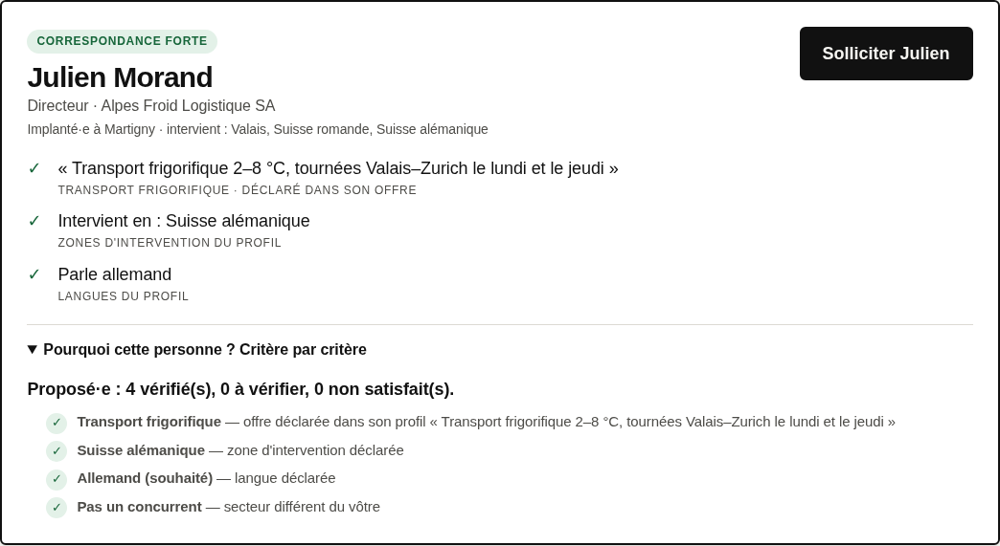

# Le Fil du Club : préparation Hack VS 2026

> **Prototype préparé AVANT Hack VS** (Martigny, 3–4 octobre 2026), pour le challenge supposé « prolonger numériquement la
> communauté du Club des Affaires de la Foire du Valais ». Le brief officiel n'est pas encore connu.
> **Toutes les personnes et entreprises sont fictives.** Aucun message réel n'est envoyé.

**Le problème.** Entre deux soirées du Club, le besoin d'un dirigeant (« un transporteur frigorifique pour Zurich ») ne
rencontre pas le membre qui pourrait y répondre.

**Ce que fait le produit.** Le membre écrit son besoin comme il le dirait. Le Club le fait parvenir **aux seuls membres
capables d'y répondre**, avec **la preuve** de pourquoi eux ; la mise en relation se fait avec consentement ; avant chaque
soirée, un plan de rencontres optimisé dit qui doit voir qui. Quand personne ne convient, le produit **le dit**, et le
Club voit quelles compétences lui manquent.

**Pourquoi l'IA, et pourquoi ce n'est pas un chatbot.** L'IA **comprend et propose** (règles multilingues, modèle
sémantique local, LLM optionnel Claude ou Apertus) ; le **code décide** (consentement, zone, langue, concurrence,
preuves citées mot pour mot) ; **l'humain confirme**. Nous avons mesuré que la similarité sémantique ne sait pas dire
« je ne sais pas » : elle n'a donc jamais le dernier mot. Un assistant IA externe peut piloter tout le Club via **MCP**,
sauf décider à la place du membre.



## Ce qui fonctionne (vérifié)

| | Détail | Preuve |
|---|---|---|
| Parcours complet | besoin → critères → clarification → membres + preuves → publication → proposition d'aide → acceptation → rencontre → clôture | parcours navigateur bureau et mobile, captures dans `docs/captures` |
| « Pourquoi / pourquoi pas » | critère par critère ; raison tue si elle touche au consentement | `27_pourquoi`, `28_pourquoi_pas` |
| IA locale | propose 1 à 3 compétences quand les règles échouent (e5 multilingue, ONNX, CPU, ≈ 77 ms) | jeu réservé : hit@3 0,875 → **0,917**, options hors sujet 69 % → 54 % ; **italien sans aucune règle : 12/12** |
| Boucle « IA propose, membre confirme » | jeux réservés les plus durs : succès@3 3/15 → **15/15**, 0 mauvais contact ajouté (borne haute : membre simulé) | [EVALUATION.md §3](docs/EVALUATION.md) |
| Plan de soirée | programme linéaire, **optimum prouvé** (< 0,1 s) ; 150 membres : 92 participants avec une rencontre utile contre 74 (glouton) ; langue commune ; export agenda | `/soiree`, `36_soiree` |
| Agent IA (MCP) | 10 outils, confirmation humaine obligatoire, jetons + portées en HTTP, erreurs à code stable | [transcription](docs/captures/agent_mcp.md) |
| Sécurité | profils = données non fiables ; LLM sans accès aux profils ; injection testée ; télémétrie tierce coupée | [EVALUATION.md §7](docs/EVALUATION.md) |
| Ingénierie | 53 tests, lint, intégration continue verte, non-régression des évaluations, jeux réservés écrits avant le code | `.github/workflows/ci.yml` |

**Simulé / fictif** : 37 profils de démo, 150 profils synthétiques, historique du Club, confirmations du « membre
simulé », agent scripté de la transcription. **Non vérifié** : Claude et Apertus contre leurs API réelles (pas de clé
ni d'accès réseau ici ; testés contre des serveurs simulés), utilité auprès de vrais membres. Voir [LIMITATIONS.md](docs/LIMITATIONS.md).

## Lancer
```bash
cd prototype
pip install -r requirements.txt            # + requirements-dev.txt pour tests et captures
python scripts/telecharger_modele.py       # facultatif : IA locale (2,2 Go, sans clé)
uvicorn app.main:app                       # http://localhost:8000
```
Pages : `/` espace membre · `/soiree` plan de soirée · `/club` vue du Club · `/scene` deux membres en direct ·
`/presentation` pitch hors ligne. Docker : `docker build -t fil-du-club . && docker run -p 8080:8080 fil-du-club`.

Brancher un assistant IA : `claude mcp add fil-du-club -e HACKVS_API_URL=http://localhost:8000 -e HACKVS_MCP_MEMBRE=p00 -- python <chemin>/prototype/scripts/mcp_club.py` (détails : [HANDOFF.md](docs/HANDOFF.md)).

| Variable | Effet |
|---|---|
| `HACKVS_MODE=demo` (défaut) / `reel` | `reel` : uniquement `HACKVS_PROFILS=<fichier autorisé>` ; sinon 503/501, jamais de simulation |
| `HACKVS_LLM=claude` + `ANTHROPIC_API_KEY` | Analyse par Claude en flux, validée par le code ; repli affiché sur les règles |
| `HACKVS_LLM=apertus` + `APERTUS_API_KEY`, `APERTUS_BASE_URL`, `APERTUS_MODEL` | Même chose avec Apertus (API compatible OpenAI) |
| `HACKVS_SEMANTIQUE=0` | Désactive l'IA locale |

## Vérifier
```bash
python -m pytest -q                        # 53 tests (dont MCP stdio et HTTP de bout en bout)
python -m eval.run_eval --verifier         # non-régression des 6 jeux
python scripts/parcours_demo.py --url http://localhost:8000   # navigateur réel → docs/captures/
python scripts/demo_agent_mcp.py           # transcription de l'agent MCP
```

## Documentation
[ARCHITECTURE](docs/ARCHITECTURE.md) · [DEMO](docs/DEMO.md) (scénarios 60 s / 3 min / 5 min, objections) ·
[EVALUATION](docs/EVALUATION.md) · [LIMITATIONS](docs/LIMITATIONS.md) · [DECISIONS](docs/DECISIONS.md) ·
[OPEN_SOURCE_RECON](docs/OPEN_SOURCE_RECON.md) · [RESEARCH](docs/RESEARCH.md) · [ASSUMPTIONS](docs/ASSUMPTIONS.md) ·
[HANDOFF](docs/HANDOFF.md) · [DEPLOIEMENT](docs/DEPLOIEMENT.md) · [AUDIT_PACKET](docs/AUDIT_PACKET.md) · [REPRISE](docs/REPRISE.md) · [LEARNING](docs/LEARNING.md)
