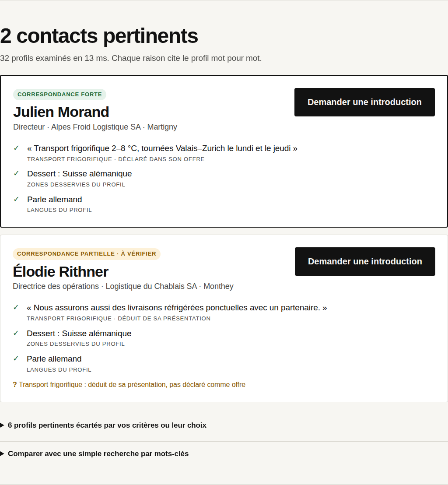

# Le Fil du Club : préparation Hack VS 2026

> **Prototype exploratoire préparé AVANT Hack VS** (Martigny, 3–4 octobre 2026), pour le challenge supposé
> « prolonger numériquement la communauté du Club des Affaires de la Foire du Valais ».
> Le brief officiel n'est pas encore connu. **Toutes les données sont fictives.**

**Idée** : un membre exprime un besoin (écrit ou dicté). Le produit en tire des critères éditables et propose 1 à 3 membres
du Club, avec des raisons citées mot pour mot dans leur profil. Il organise une introduction que la personne sollicitée
accepte ou non, puis suit le résultat. S'il n'y a pas de bonne correspondance, il le dit.



## Lancer
```bash
cd prototype
pip install -r requirements.txt
uvicorn app.main:app            # puis ouvrir http://localhost:8000
```
Options (variables d'environnement) :
| Variable | Effet |
|---|---|
| `HACKVS_MODE=demo` (défaut) / `reel` | `reel` n'utilise que `HACKVS_PROFILS=<fichier autorisé>` ; sans fichier, l'API répond 503 |
| `HACKVS_LLM=claude` + `ANTHROPIC_API_KEY` | Analyse du besoin par Claude, validée par le code ; repli affiché sur les règles |
| `HACKVS_CLAUDE_MODEL` | Modèle Claude (défaut `claude-opus-5`) |
| `HACKVS_DB` | Chemin SQLite des introductions (défaut `prototype/var/`) |

Vérifier :
```bash
python -m pytest -q tests          # 12 tests
python -m eval.run_eval            # → prototype/eval/resultats.md
python scripts/parcours_demo.py    # parcours réel dans Chromium + captures (serveur lancé sur :8000)
```

## État réel (28.09.2026)
| Fonctionne (vérifié) | Simulé | Manquant / non vérifié |
|---|---|---|
| Parcours complet besoin → critères → contacts → introduction → suivi, dans le navigateur (bureau et mobile) | Réponse de la personne sollicitée (bouton « Simuler », mode démo uniquement) | Analyse par Claude **jamais exécutée en réel** (pas de clé dans l'environnement ; testée avec un client simulé) |
| Analyse par règles hors ligne, termes ambigus, critères souhaités ou obligatoires | Profils (33, fictifs) | Mode réel : aucune source de données autorisée |
| Filtres durs (consentement, communauté, disponibilité, zone, langue, concurrence) ; abstention | Envoi de message : **rien n'est envoyé** | Dictée vocale : non testée dans la salle (dépend de Chrome et du réseau) |
| Explications vérifiées mot pour mot ; comparaison avec une recherche par mots-clés | | Brief, règlement et critères du jury : inconnus |
| Évaluation exploratoire (20 cas) ; 12 tests | | Aucune validation par des membres réels |

## Documentation
- [docs/RESEARCH.md](docs/RESEARCH.md) : sources, statut de chaque information
- [docs/DECISIONS.md](docs/DECISIONS.md) : concepts comparés, stack, compromis
- [docs/ASSUMPTIONS.md](docs/ASSUMPTIONS.md) : hypothèses, questions terrain
- [docs/DEMO.md](docs/DEMO.md) : scénario de 60 s, pitch 1/3/5 min, questions du jury, plan de secours
- [docs/HANDOFF.md](docs/HANDOFF.md) : prise en main par l'équipe
- [docs/AUDIT_PACKET.md](docs/AUDIT_PACKET.md) : dossier pour l'auditeur externe
- [docs/LEARNING.md](docs/LEARNING.md) : notions à maîtriser pour défendre le projet
