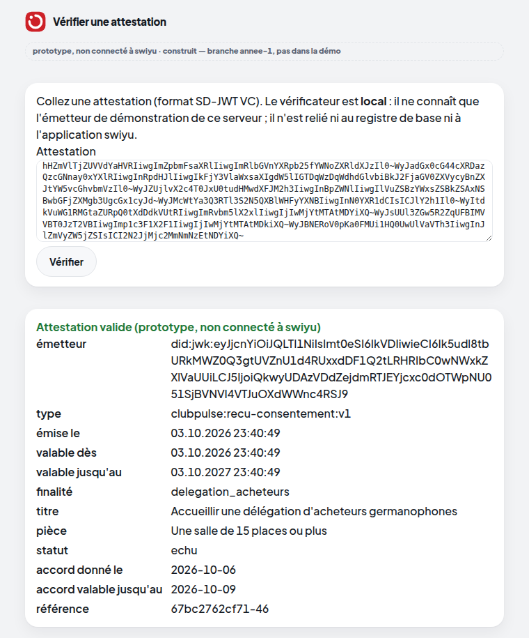

# Lot 10 — Prototype e-ID et attestations

> **Prototype, non connecté à swiyu.** **Construit — branche `annee-1`, pas dans la démo.** Interrupteur
> `HACKVS_EID=1` (éteint par défaut).

**Ce qui a été vérifié contre une source, cette nuit.** Le format suit le profil suisse d'interopérabilité de swiyu
(copie de référence : [eid/swiss-profile-source.md](../eid/swiss-profile-source.md), téléchargée du dépôt public
`e-id-admin/open-source-community`) et le README de `swiyu-admin-ch/swiyu-issuer` :

| Exigence du profil | Ce prototype |
|---|---|
| SD-JWT VC, sérialisation compacte | oui (`<jwt>~<divulgation>~…~`) |
| ES256 sur P-256 ; SHA-256 pour les empreintes | oui |
| `vct` et `iss` obligatoires, jamais divulgables ; `iat` / `nbf` / `exp` présents | oui (test `test_le_format_suit_le_profil_suisse`) |
| autres affirmations divulgables sélectivement | oui (finalité, titre, pièce, statut, dates, référence) — test `test_divulgation_selective` |
| `iss` = DID résolu par le `kid` | **`did:jwk` local** ; le profil demande `did:tdw` inscrit au registre de base : **non fait** |
| liste de statut (Token Status List) | **non faite** (un retrait n'invalide pas une attestation déjà émise : le statut est celui du jour d'émission) |
| OID4VCI (émission vers un portefeuille), OID4VP (présentation) | **non faits** : copier-coller dans la page du vérificateur local |
| liaison d'appareil (KB-JWT) | **non faite** (le profil la rend facultative à l'émission ; sans elle, rejeu possible) |

Le profil récent nomme le format `dc+sd-jwt` (README de l'émetteur swiyu ; `vc+sd-jwt` y est dit déprécié) ; ce
prototype suit le profil « Public Beta » (`vc+sd-jwt`).

**Preuves.** Signature, divulgation et période vérifiées ; trois falsifications refusées (divulgation, corps,
signature) ; attestation échue refusée ; aucun identifiant du membre dans l'attestation ; vérifiée dans un vrai
navigateur : `prototype/tests/test_annee1_attestations.py`.

**Dates.** L'émission suit l'heure réelle du serveur ; le monde de démonstration suit une date simulée (d'où « émise le
03.10 » pour un accord « donné le 06.10 » sur la capture).
