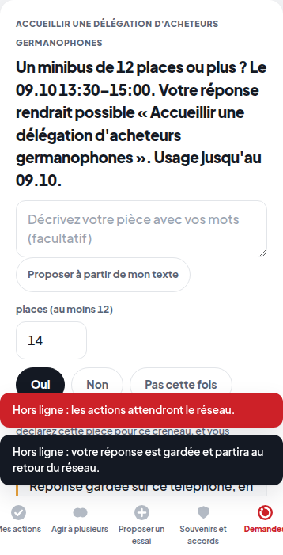

# Lot 11 — Qualité : accessibilité, application installable, hors ligne, charge, budgets

> **Construit — branche `annee-1`, pas dans la démo.** Interrupteur de la file hors ligne : `HACKVS_HORS_LIGNE=1`
> (éteint par défaut). Les autres volets sont des tests et des mesures.

| Volet | Ce qui est fait | Preuve |
|---|---|---|
| Accessibilité WCAG 2.2 AA vérifiée automatiquement | axe-core 4.13.0 (copie vérifiée par empreinte) dans un vrai Chromium, étiquettes `wcag2a`, `wcag2aa`, `wcag21a`, `wcag21aa`, `wcag22aa`, sur plus de 30 états de pages (téléphone connecté, FR / DE / EN, espace membre, secrétariat élevé, borne, écrans) tout allumé, puis la démo telle quelle ; contre-preuve d'un champ piégé. Deux violations trouvées et corrigées (contraste des fenêtres sur `/projection`, deux listes sans étiquette) | `prototype/tests/test_annee1_accessibilite.py` |
| Application installable (PWA) | Chromium ne relève **aucune** erreur d'installabilité (`Page.getInstallabilityErrors`, contexte persistant) | `test_l_application_est_installable_selon_chromium` |
| File d'attente hors ligne des réponses | une réponse donnée sans réseau est gardée, dite « en attente », puis envoyée au retour du réseau ; une demande qui n'est plus d'actualité est refusée par le serveur, retirée de la file, et le membre le lit ; éteint : rien n'est gardé, comme dans la démo ([ADR 0009](../../ADR/0009-file-hors-ligne-des-reponses.md)) | `prototype/tests/test_annee1_hors_ligne.py` (réseau coupé par le navigateur) |
| Tests de charge à 500 puis 1 000 membres simulés | `prototype/scripts/charge_membres.py` : monde SYNTHÉTIQUE de N membres, N comptes activés au rythme permis, N membres en parallèle (16 fils) pendant que la console relit l'Établi | [qualite/charge_500.json](../qualite/charge_500.json), [qualite/charge_1000.json](../qualite/charge_1000.json) |
| Budgets de performance | pages (octets, requêtes, temps de chargement) vérifiés à chaque suite ; p95 de l'API sous 500 et 1 000 membres vérifiés par le script de charge | [qualite/budgets.json](../qualite/budgets.json), `prototype/tests/test_annee1_budgets.py` |

## Résultats de charge (machine de cette nuit : Linux, 4 cœurs, boucle locale)

| | 500 membres | 1 000 membres |
|---|---|---|
| comptes activés | 500 / 500 | 1000 / 1 000 |
| erreurs | 0 | 0 |
| « oui » acceptés sans reçu | 0 | 0 |
| lecture d'un membre, pire p95 (budget) | 86.0 ms (500) — respecté | 78.7 ms (1000) — respecté |
| réponse à une demande, p95 (budget) | 144.6 ms (1000) — respecté | 237.7 ms (2000) — respecté |
| console, pire p95 (budget) | 96.9 ms (2000) — respecté | 127.4 ms (4000) — respecté |

**Premier passage : budget des lectures DÉPASSÉ** (540 ms pour 500 ; 1 594 ms pour 1 000). Les budgets ont été écrits
AVANT la mesure et n'ont pas été relevés. Cause trouvée au profileur : « Mes données » reconstruisait l'index
bi-temporel des claims de TOUT le Club à chaque lecture (163 ms à 1 000 membres, contre 4 ms pour les autres
lectures), et chaque lecture attend les autres derrière le verrou du monde. Correctif : l'index est gardé tant que la
version du journal ne change pas (toute écriture, annulation ou purge le fait recalculer — testé, purge comprise :
`prototype/tests/test_annee1_charge_lectures.py`). Le tableau ci-dessus est le second passage, même script, mêmes
budgets.

**Limites.** Pas de vrais téléphones ni de vrai réseau ; journal SQLite (pas PostgreSQL) ; sur 15 réponses tentées
par membre ayant une demande, une seule est acceptée (la pièce est trouvée au premier oui, les autres demandes ne
sont plus d'actualité : 404 attendu). L'accessibilité vérifiée est celle des règles AUTOMATISABLES d'axe : l'usage
réel au lecteur d'écran, l'ordre de lecture et le sens des textes restent à éprouver par des personnes.
