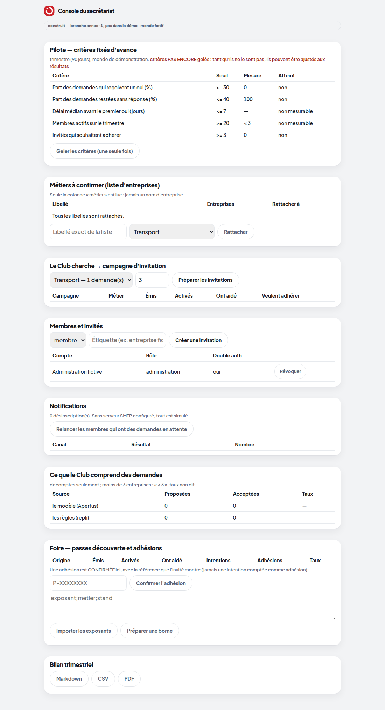
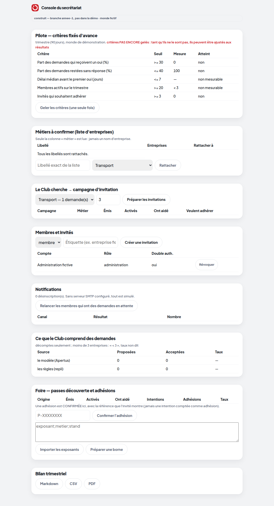
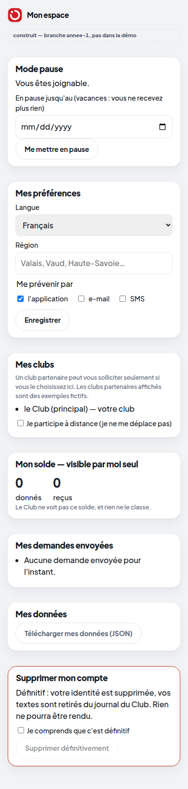
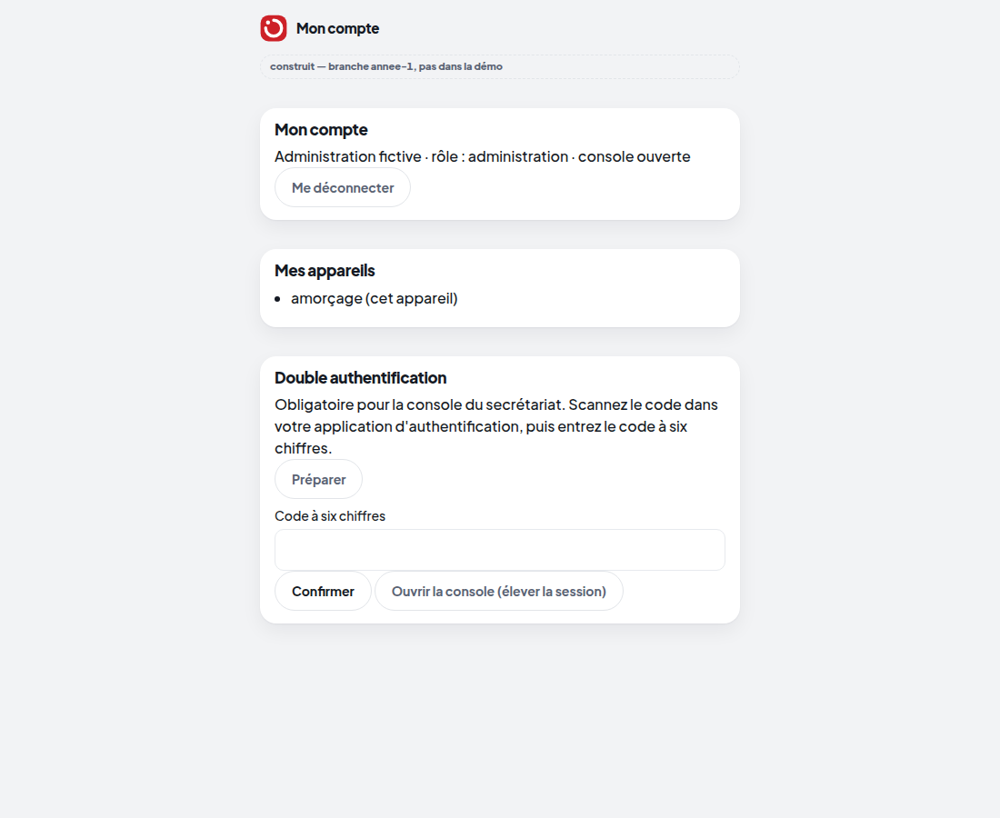

# Lot 12 — Cohérence avec le Design System

> **Construit — branche `annee-1`, pas dans la démo.** Décision écrite : [ADR 0010](../../ADR/0010-coherence-visuelle-annee-1.md).

Passe de cohérence des pages de l'année 1 avec [DESIGN_SYSTEM.md](../../design/DESIGN_SYSTEM.md) : chaque couleur est
un jeton (`var(--…)`), plus aucune valeur de repli inventée ; lignes de tableau en `--hairline-3`, succès en
`--green-deep`, erreurs en `--brand`. Vérifié par un test : `prototype/tests/test_annee1_coherence_design.py` (rouge
avant la passe sur 4 pages, vert après ; contre-preuve d'une couleur inventée).

| Page | Avant | Après |
|---|---|---|
| Console du secrétariat |  |  |
| Mon espace |  |  |
| Compte |  |  |
| Borne |  |  |

**Différences visibles : faibles** (nuances de gris des filets, vert et rouge des messages) : les pages utilisaient
déjà les feuilles communes. **Pas de refonte plus profonde** cette nuit (ADR 0010) : elle demanderait des planches
validées et la barrière. **Écrans de la démo non retouchés** (régie, écran de salle, preflight : couleurs voulues).
