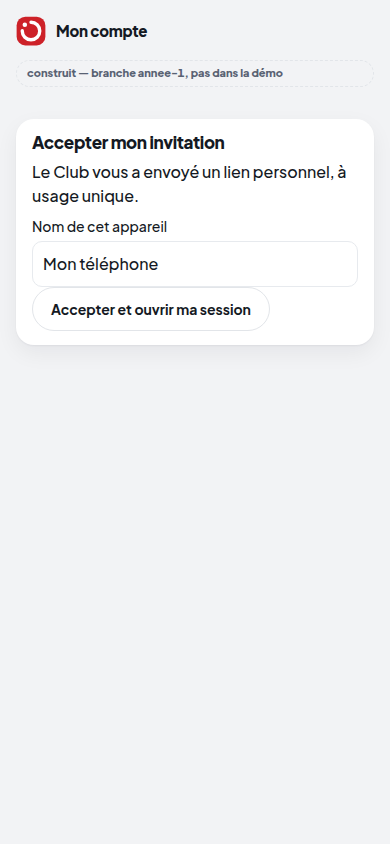
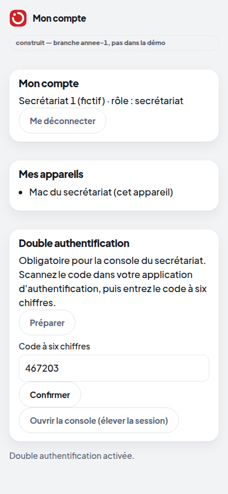

# Vitrine · lot 2 — Authentification et rôles

> **Construit — branche annee-1, pas dans la démo.** Captures réelles (serveur neuf, monde fictif, `HACKVS_COMPTES=1`),
> par `prototype/scripts/capturer_vitrine_annee1.py`. Le jeton partagé de la console reste celui de la démo.

| L'invitation personnelle (lien à usage unique) | Le compte : appareils, double authentification activée |
|---|---|
|  |  |

Ce qu'il faut savoir :

- Le premier compte (administration) s'amorce une seule fois : `scripts/comptes.py amorcer "…"`. Ensuite, chaque compte
  naît d'une invitation envoyée par le Club ; le journal ne garde que son empreinte.
- La console exige un compte **nominatif** (secrétariat ou administration), la double authentification activée, et un
  code du jour (session « élevée » 12 heures). Un code ne sert qu'une fois.
- Le secret TOTP n'est stocké nulle part : il est dérivé du secret du serveur et d'un nonce journalisé.
- Ce qui n'est PAS fait : brancher ces comptes sur les écrans existants de la démo (qui gardent leurs codes
  d'invitation de démonstration et le jeton partagé) — prévu au lot 4 ; l'envoi réel du lien (lot 5).
