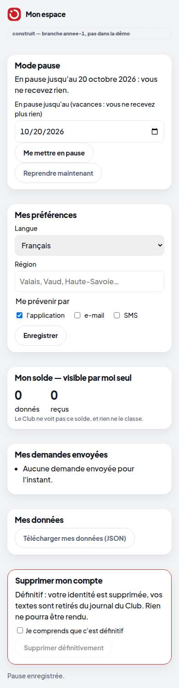

# Lot 3 — L'espace membre

> **Construit — branche `annee-1`, pas dans la démo.** Interrupteur `HACKVS_ESPACE_MEMBRE=1` (éteint par défaut).
> Capture réelle d'un membre FICTIF du monde de démonstration : `python prototype/scripts/capturer_vitrine_annee1.py`.

| Demandé par la mission | Où | Preuve |
|---|---|---|
| Premier lancement guidé, déclarer ce qu'on offre | existait (accueil de l'application membre) | tests existants de l'accueil |
| Mes demandes envoyées | `/moi/espace` → `demandes` | `test_mes_demandes_envoyees` |
| Historique des reçus, clôture | existait (reçus ISO/IEC TS 27560, clôture de l'essai) | tests existants |
| Préférences langue / région / canaux | `/moi/preferences` | `test_preferences_langue_region_canaux` |
| MODE PAUSE | `/moi/pause`, `/moi/pause/fin` ; `ClubPulse._membre_peut` | `test_mode_pause_on_ne_recoit_plus_rien_jusqu_a_la_date`, `test_la_pause_survit_a_un_redemarrage` |
| Solde privé « reçus / donnés » | `/moi/espace` → `solde` (visible par le membre seul) | `test_pause_preferences_et_espace` |
| Export de mes données | `/moi/export` (fichier JSON) | `test_export_de_mes_donnees_et_rien_d_autre`, `test_export_telechargeable` |
| Suppression du compte avec purge réelle | `/moi/effacer-definitivement` (confirmation exigée) | `test_purge_reelle_…`, `test_apres_purge_…`, `test_reecrire_est_tout_ou_rien` (SQLite + PostgreSQL) |

**Ce que la purge fait vraiment.** L'effacement d'avant (`ClubPulse.effacer`) retirait l'identité et ajoutait des faits
de retrait ; le passé du journal gardait les textes. La purge réécrit, en une seule transaction, chaque fait qui porte
le membre : ses textes libres deviennent « [effacé] », les identifiants techniques restent (sans eux le journal ne se
rejoue plus). Les faits des autres membres sont identiques à l'octet. Une trace `PURGE {faits: n}` sans contenu.

**Limite connue.** Les sauvegardes JSONL faites AVANT la purge contiennent encore les textes : la politique de
rétention des sauvegardes (lot 6) doit fixer leur durée de vie.
