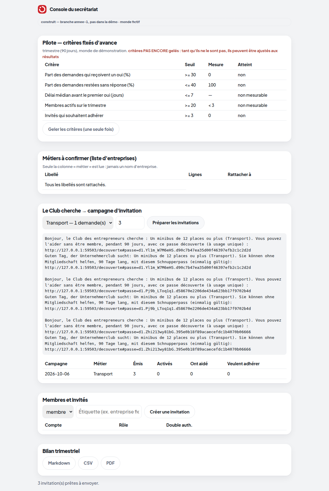

# Lot 4 — La console du secrétariat

> **Construit — branche `annee-1`, pas dans la démo.** Interrupteurs `HACKVS_COMPTES=1` et `HACKVS_SECRETARIAT=1`
> (éteints par défaut). Capture réelle, monde FICTIF : `python prototype/scripts/capturer_vitrine_annee1.py` — le compte
> « Secrétariat 1 (fictif) » est invité, accepte, active la double authentification, élève sa session par un code, puis
> ouvre la console et prépare une campagne.

| Demandé par la mission | Où | Preuve |
|---|---|---|
| Gestion des membres (inviter, révoquer, rôles) | console : membres et invités ; l'administration change les rôles (lot 2) | `test_gestion_des_comptes_depuis_la_console` |
| Confirmation des métiers à vérifier | « Métiers à confirmer » (colonne métier seule) | `test_les_metiers_non_reconnus_…`, `test_confirmer_un_metier_…` |
| Annonces sous chiffre | existait (Foire 2026) | `test_annonces.py` |
| Escalade vers les piliers volontaires | existait (P3 n°15) | tests existants des piliers |
| Tableau de bord du pilote, critères fixés d'avance | « Pilote » + `docs/annee-1/pilote/criteres.json` (PROPOSITION à fixer en comité) | `test_les_criteres_du_pilote_sont_geles_…` |
| Bilan trimestriel exportable (Markdown, CSV, PDF) | « Bilan trimestriel » | `test_bilan_exportable` (le PDF commence bien par `%PDF-`) |
| « Le Club cherche » relié à une campagne d'invitation | « Campagne d'invitation » | `test_une_campagne_relie_…` |

**Ce que montre la capture, honnêtement.** Les mesures du pilote sont celles du monde de démonstration au début de la
démo (aucun oui encore) : « non » et « non mesurable » partout. Aucun seuil ne vient d'un pilote réel.
