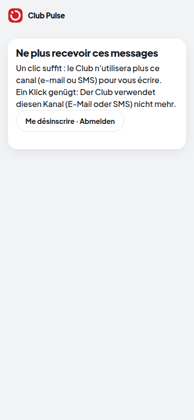

# Lot 5 — Notifications réelles

> **Construit — branche `annee-1`, pas dans la démo.** Interrupteur `HACKVS_NOTIFICATIONS=1` (éteint par défaut).
> **Sans `SMTP_HOST`, tout est SIMULÉ** (la démonstration) : le suivi dit « simulé », rien ne part. Aucun vrai
> fournisseur SMS n'est branché : l'interface existe, testée avec un faux fournisseur.

## Un e-mail réel, reçu par un serveur SMTP local (sortie réelle, membre FICTIF)

Le membre fictif a choisi l'allemand et l'e-mail (préférences du lot 3). Commande : voir
`prototype/tests/test_annee1_notifications.py` (serveur SMTP minimal sur la boucle locale).

```text
résultat : [{'canal': 'email', 'modele': 'demandes_en_attente', 'statut': 'envoye', 'raison': '', 'langue': 'de'}]
--- message reçu par le serveur SMTP local (destinataire FICTIF) ---
From: club@exemple.invalid
To: pauline.darbellay@exemple.invalid
Subject: Der Club: 2 Anfragen warten auf Ihre Antwort
List-Unsubscribe: <https://club.exemple/desinscription#j=s01.email.PsXLGNXP.4129dfda55058d90585b7ca96aa2b028>
Content-Type: text/plain; charset="utf-8"
Content-Transfer-Encoding: quoted-printable
MIME-Version: 1.0
Guten Tag

2 Anfragen von Clubmitgliedern warten auf Ihr Ja, Ihr Nein oder ein « diesmal nicht ». Eine Antwort dauert eine Minute:
https://club.exemple/app

Freundliche Grüsse
Das Clubsekretariat

— Diese E-Mails nicht mehr erhalten: https://club.exemple/desinscription#j=s01.email.PsXLGNXP.4129dfda55058d90585b7ca96aa2b028

--- ce que le journal garde ---
[{'canal': 'email', 'modele': 'demandes_en_attente', 'resultat': 'envoye', 'raison': '', 'langue': 'de', 'n': 17, 'acteurs': ['s01']}]
```

Le journal ne garde **ni l'adresse, ni le contenu** : canal, modèle, résultat, langue.

## La page de désinscription (lien signé de chaque message)



| Demandé par la mission | Où | Preuve |
|---|---|---|
| Adaptateur e-mail SMTP générique | `SmtpGenerique` (STARTTLS, identifiants par l'environnement) | `test_un_email_part_vraiment_par_smtp_…`, `test_relance_reelle_par_smtp_…` |
| Adaptateur SMS : interface + faux fournisseur testé | `FauxSms` (même interface qu'un vrai) | `test_le_faux_fournisseur_sms_et_le_mode_simule` |
| Modèles FR / DE | `MODELES` (sujet, corps, SMS) | `test_chaque_modele_existe_en_francais_et_en_allemand` |
| Suivi d'envoi | faits `NOTIF_ENVOI` (sans adresse ni contenu), tableau dans la console du secrétariat | `test_le_journal_ne_garde_ni_adresse_ni_contenu`, `test_un_echec_smtp_est_suivi_jamais_cache` |
| Désinscription | lien signé + `List-Unsubscribe` ; page `/desinscription` | `test_desinscription_par_lien_signe` |
| En démo, tout simulé et étiqueté | sans `SMTP_HOST` : « simulé » | `test_relance_simulee_sans_smtp` |
| Respect de la pause et des canaux choisis (lot 3) | `Notifications.envoyer` | `test_en_pause_on_ne_recoit_rien`, `test_seuls_les_canaux_choisis_sont_utilises` |

**Limites.** Un échec SMTP est suivi, pas réessayé (pas de file d'attente). Un membre qui a choisi l'anglais ou
l'italien reçoit le français (seuls FR et DE sont rédigés). Aucun envoi réel n'a été fait vers une vraie adresse.
