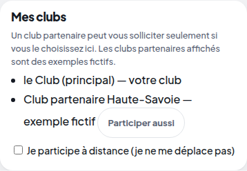
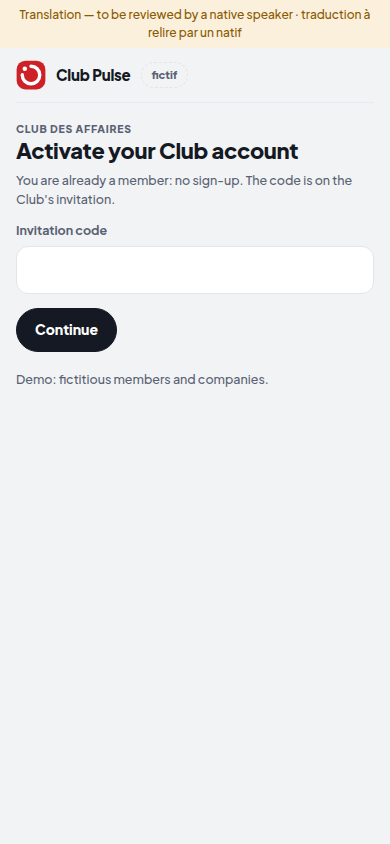

# Lot 8 — Grandir : plusieurs clubs, transfrontalier, FR / DE / EN

> **Construit — branche `annee-1`, pas dans la démo.** Interrupteur `HACKVS_MULTICLUB=1` (éteint par défaut).
> **Aucun club partenaire n'est acquis** : un club partenaire ne peut être déclaré que comme EXEMPLE FICTIF, et son nom
> le dit. Traductions anglaises et allemandes **à relire par un natif** (bandeau sur chaque écran).

| Demandé par la mission | Où | Preuve |
|---|---|---|
| Notion de « club », club partenaire (exemple fictif marqué) | `intelligence/clubs.py` ; console : `/api/pulse/secretariat/clubs` | `test_un_club_partenaire_est_un_exemple_fictif_marque` |
| Adhésion croisée | choisie par le MEMBRE dans « Mon espace », retirable | `test_adhesion_croisee_demandee_par_le_membre_et_retirable` |
| Membres à distance | case « Je participe à distance », décompte dans la console | `test_membre_a_distance`, `test_la_console_ne_voit_que_des_decomptes` |
| Interface complète FR / DE / EN | couche de traduction du téléphone : l'anglais couvre chaque libellé de l'allemand | `test_l_anglais_couvre_chaque_libelle_de_l_allemand`, `test_l_interface_en_anglais_dans_un_vrai_navigateur` |

**Limites, dites telles quelles.** La mise en relation ne lit pas encore le club d'une demande : toutes les demandes
restent celles du club principal (`peut_etre_sollicite` est la règle prête à brancher). « À distance » est déclaré et
compté, pas encore utilisé pour choisir qui solliciter. La couche de traduction couvre les libellés du téléphone
(« Mon espace », la console et les pages du secrétariat restent en français) ; les textes des membres restent dans leur
langue.
