# Visite guidée — chaque écran, chaque bouton

Captures **réelles** du produit, prises le 03.10 sur un serveur de démonstration neuf (monde **fictif**, IA éteinte,
Foire 2026 et mode salle allumés) par `prototype/scripts/capturer_visite.py`. Les libellés des boutons ci-dessous sont
relevés automatiquement sur la page (`visite/boutons.json`) : la visite ne décrit que ce qui existe.

Les noms affichés (Pauline Darbellay, Markus…) sont des **personnages fictifs** du monde de démonstration.

## Comment on entre — qui voit quoi

| Qui | Écrans | Comment on s'identifie |
|---|---|---|
| **Un membre** | `/app` (téléphone) | un **code d'invitation** personnel (en démo : `s01` pour Pauline), une fois ; une session signée garde la connexion. « Se déconnecter » dans *Souvenirs et accords* |
| **Un juré** (démo) | `/app` en mode juré | un **QR juré** affiché par l'Établi : passe à usage unique, 15 minutes |
| **Un invité** (non-membre) | `/decouverte` | le **QR du passe découverte** (90 jours) donné par le Club ; aucun compte |
| **La salle** (pitch) | `/salle` | le **QR de la salle** ; aucun nom, aucun compte : deux gestes |
| **Le secrétariat / l'équipe** | `/etabli`, `/suivi`, `/console`, `/projection`, `/salle/regie`, `/salle/ecran` | le **jeton de la console**, demandé une fois par onglet (jamais dans l'adresse) ; en démo sans jeton, seulement depuis le Mac lui-même |
| **Tout le monde** | `/feuille-de-route`, `/confidentialite` | rien : pages publiques |
| **Le Mac du pitch** | `/preflight` | rien, mais **seulement sur ce Mac** : à travers le tunnel, la page n'existe pas |

---

## 1. Le téléphone du membre — `/app`

### Accès

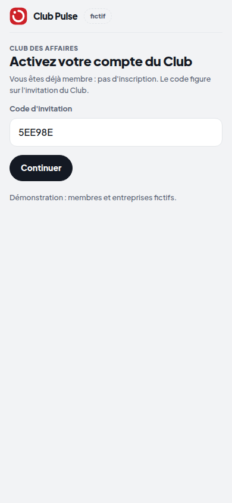

- **Continuer** : valide le code d'invitation (déjà rempli par le lien) et ouvre la session.

### Mes actions

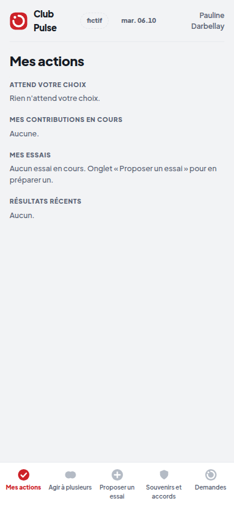

Ce qui attend un choix, mes contributions en cours, mes essais, les résultats récents. En bas, cinq onglets :

- **Mes actions** · **Agir à plusieurs** (actions collectives) · **Proposer un essai** · **Souvenirs et accords** ·
  **Demandes**.

### Demandes — le cœur : Oui / Non / Pas cette fois

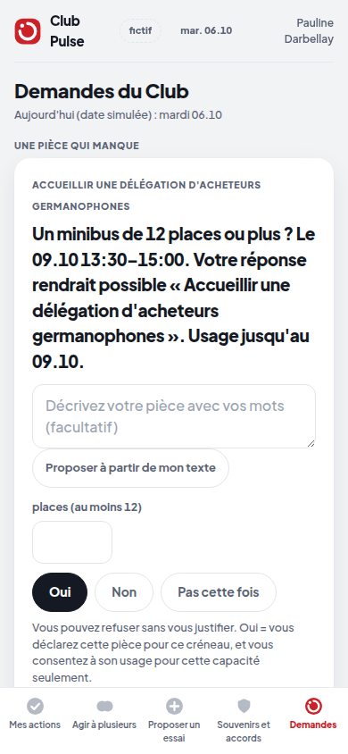

- Une demande précise, avec sa date et ce qu'elle rendrait possible.
- **Proposer à partir de mon texte** : le membre écrit avec ses mots ; une structure est proposée (IA allumée, ou
  forme déterministe), le membre la vérifie et la corrige.
- **Oui** · **Non** · **Pas cette fois** : même poids, aucune justification demandée. Un oui crée un **reçu**.

### Souvenirs et accords

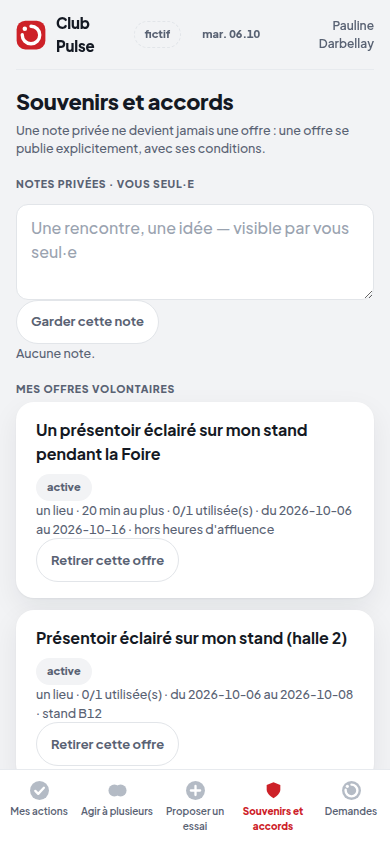

- Les reçus (daté, référencé, révocable) et les accords en cours.
- **Retirer cette offre** : retire le consentement en un geste ; l'Établi dit « un composant n'est plus disponible »,
  sans nom.
- **Garder cette note** · **Publier** : notes privées et offres.
- **Se déconnecter**.

## 2. L'Établi — `/etabli` (secrétariat, écran commun)

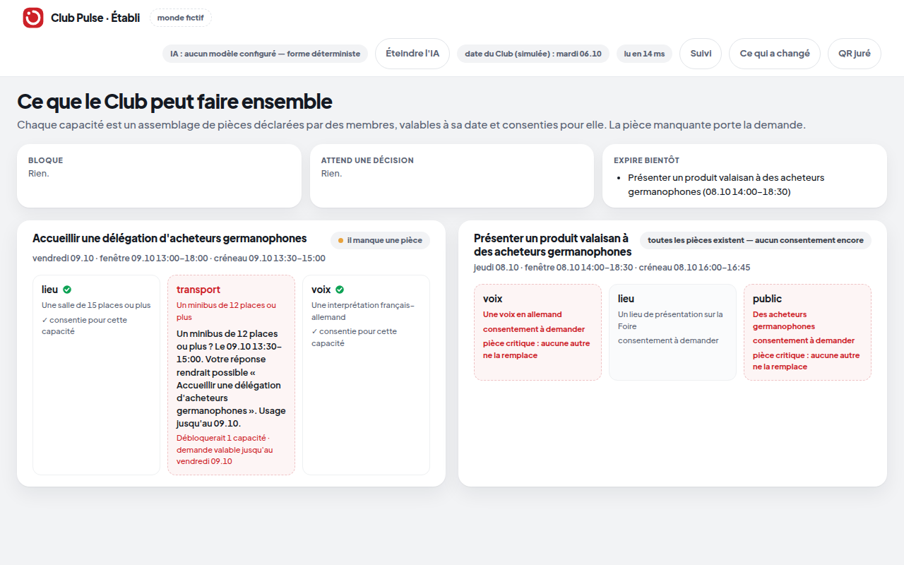

Ce que le Club peut faire ensemble : chaque capacité est un assemblage de pièces déclarées, valables à leur date et
consenties. La pièce manquante (pointillés rouges) porte la demande.

- **Éteindre l'IA** / **Allumer l'IA** : l'interrupteur (le Club reste le même — testé).
- **Suivi** : ouvre l'écran Suivi. **Ce qui a changé** : le journal des changements, en rôles.
- **QR juré** : affiche un passe à usage unique pour un juré.

## 3. Suivi — `/suivi` (secrétariat)

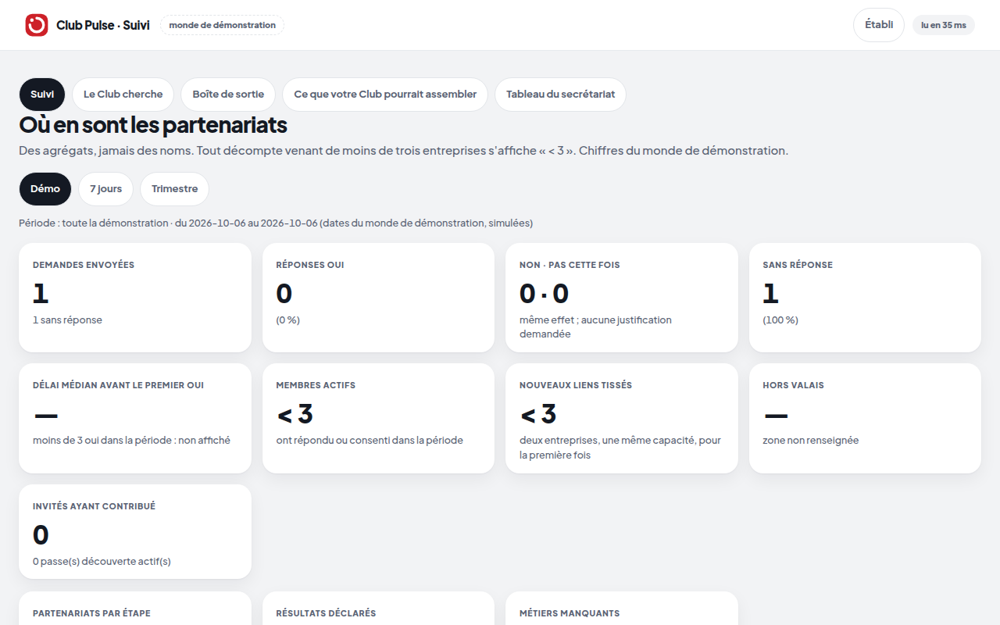

Où en sont les partenariats : agrégats seulement ; tout décompte venant de moins de trois entreprises s'affiche
« < 3 ». Onglets :

- **Suivi** (périodes **Démo**, **7 jours**, **Trimestre** ; étapes **signé**, **test sans suite**, **contact
  établi**, **abandonné** ; **QR du stand** ; **Passe start-up (180 j)**).
- **Le Club cherche** — les métiers qui manquent ; **Inviter un contact** crée un passe découverte :

  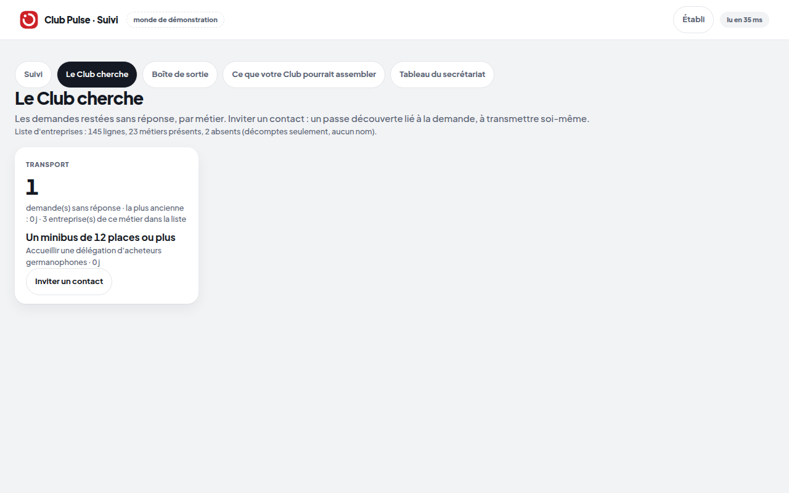

- **Boîte de sortie** — les messages qui partiraient (simulés en démo).
- **Ce que votre Club pourrait assembler** — les neuf projets types testés sur la liste du Club :

  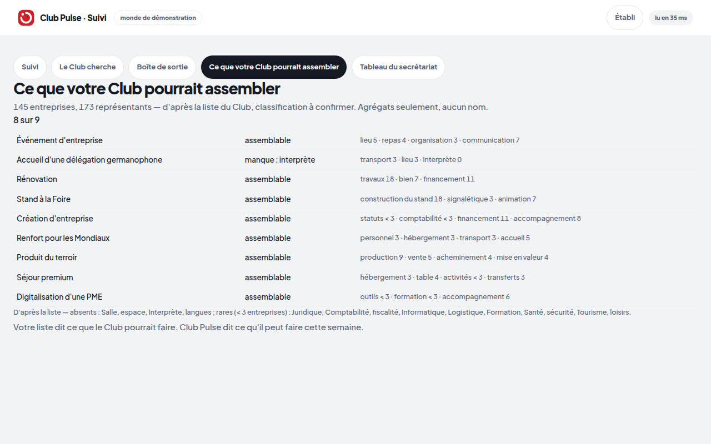

- **Tableau du secrétariat** :

  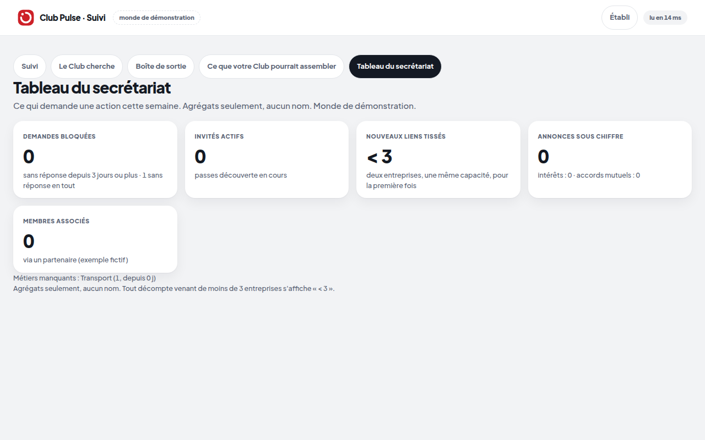

## 4. La console — `/console` (équipe, démo)

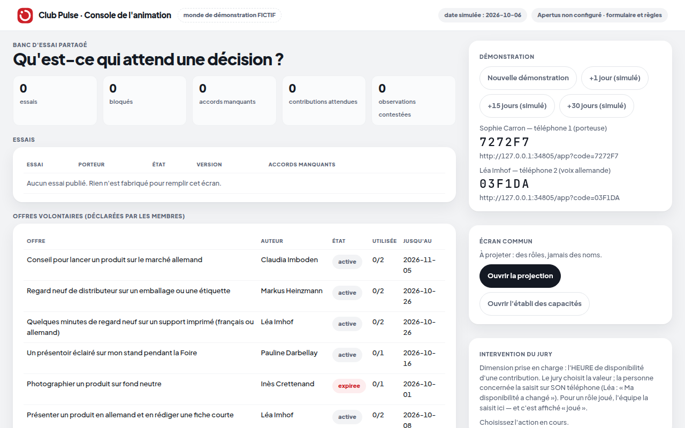

- **Nouvelle démonstration** : remet le monde fictif à zéro (une seule fois, avant la séance).
- **+1 jour / +15 jours / +30 jours (simulé)** : avance l'horloge du monde fictif.
- **Ouvrir la projection** · **Ouvrir l'établi des capacités**.
- **1. besoin … 9. après** : les étapes de l'essai guidé.

## 5. La projection — `/projection`

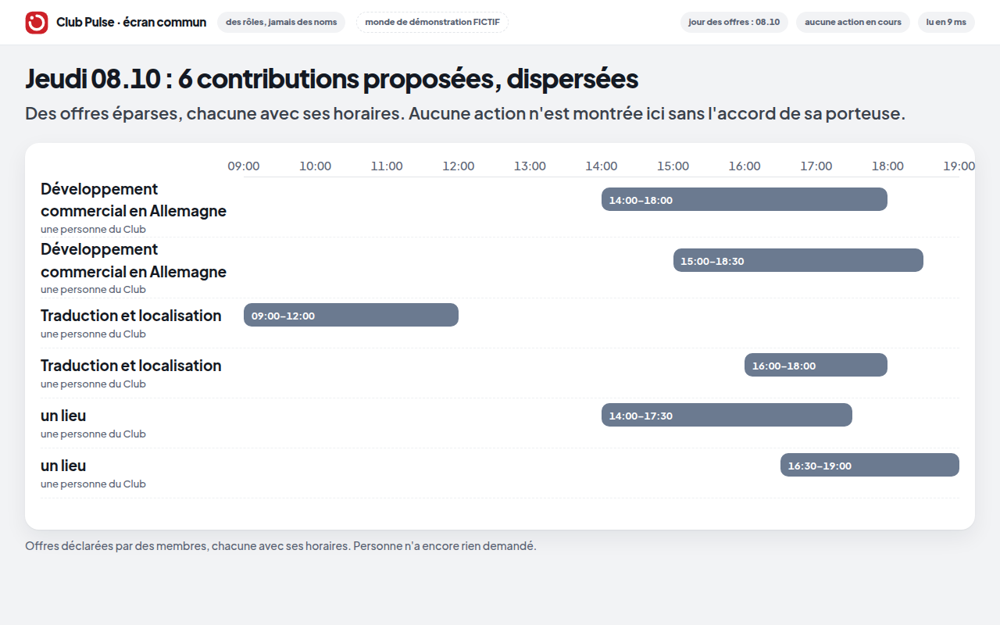

L'écran commun à projeter : rôles et agrégats seulement, aucun bouton.

## 6. Le mode salle (pitch v2)

### La régie — `/salle/regie` (V2)

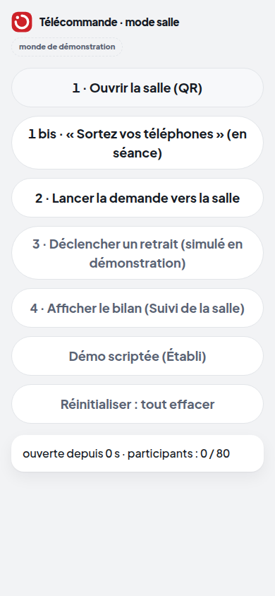

- **1 · Ouvrir la salle (QR)** — à H-30.
- **1 bis · « Sortez vos téléphones » (en séance)** — la minute de bascule automatique part d'ici.
- **2 · Lancer la demande vers la salle** · **3 · Déclencher un retrait (simulé en démonstration)** ·
  **4 · Afficher le bilan (Suivi de la salle)**.
- **Démo scriptée (Établi)** — si la salle reste vide.
- **Réinitialiser : tout effacer** — la purge promise à la salle.

### L'écran géant — `/salle/ecran` (dans le deck, slide « constellation »)

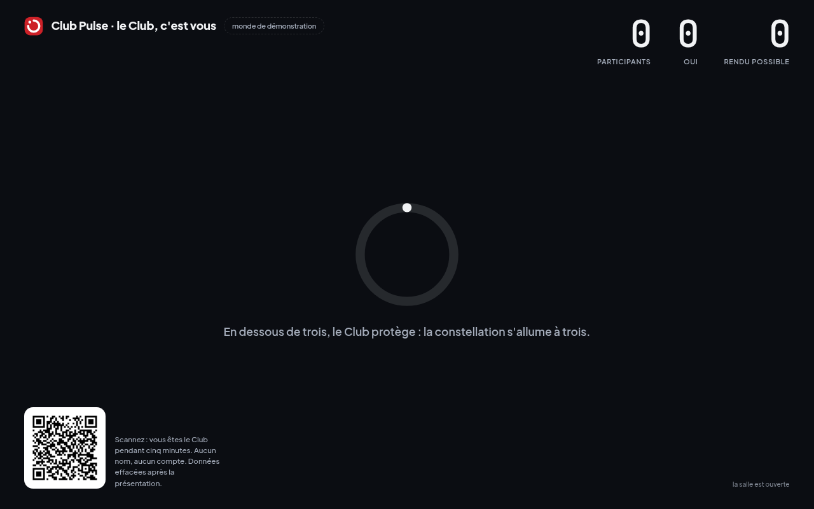

Participants, oui, « rendu possible » ; la constellation s'allume à trois ; le QR en bas à gauche. Aucun bouton.

### Le téléphone d'un participant — `/salle`

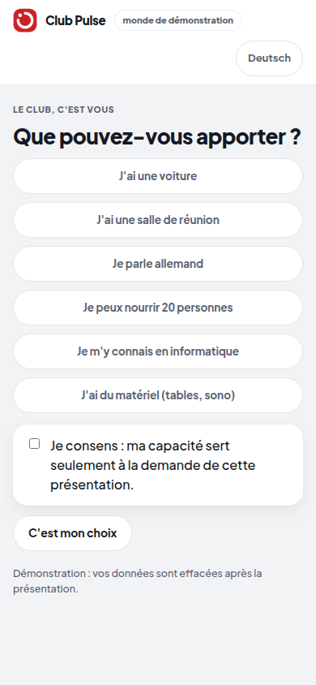

- Geste 1 : une capacité — **J'ai une voiture**, **J'ai une salle de réunion**, **Je parle allemand**, **Je peux
  nourrir 20 personnes**, **Je m'y connais en informatique**, **J'ai du matériel (tables, sono)**.
- Geste 2 : **C'est mon choix** (le consentement).
- **Deutsch** : la page en allemand.

## 7. Le passe découverte — `/decouverte` (invité, non-membre)

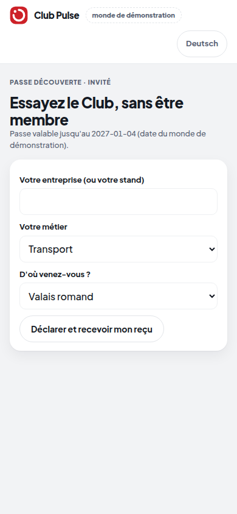

- L'invité dit son entreprise, son métier et sa région ; **Déclarer et recevoir mon reçu**. 90 jours, sans être
  membre ; « à confirmer par le Club ». **Deutsch** disponible.

## 8. Pages publiques et outil du jour J

### La feuille de route — `/feuille-de-route`

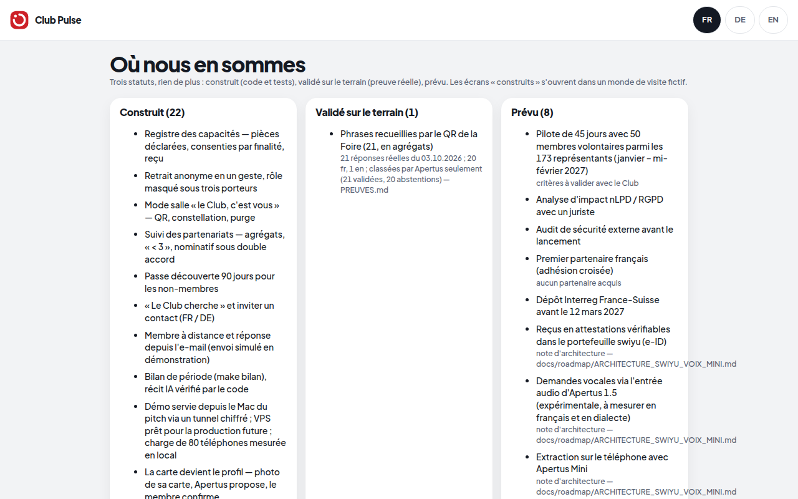

Construit / validé / prévu, lu dans `etat.yaml`. **FR · DE · EN**.

### Confidentialité — `/confidentialite`

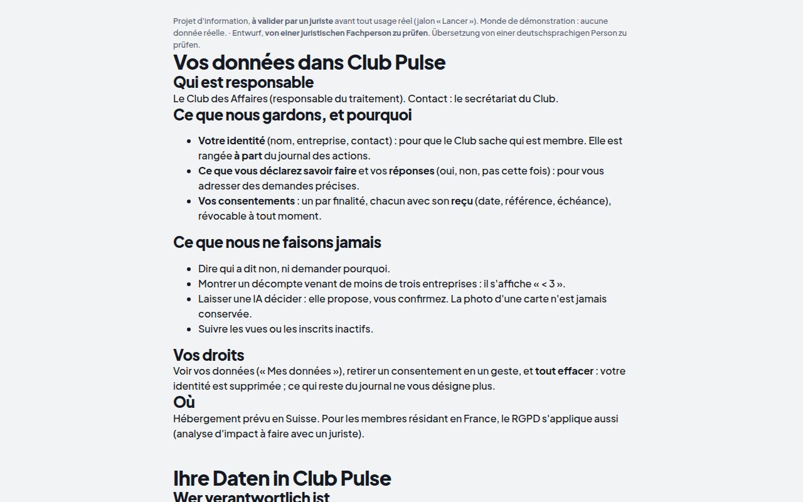

Ce que le prototype garde, pourquoi, et comment l'effacer.

### La check-list — `/preflight` (le Mac du pitch seulement)

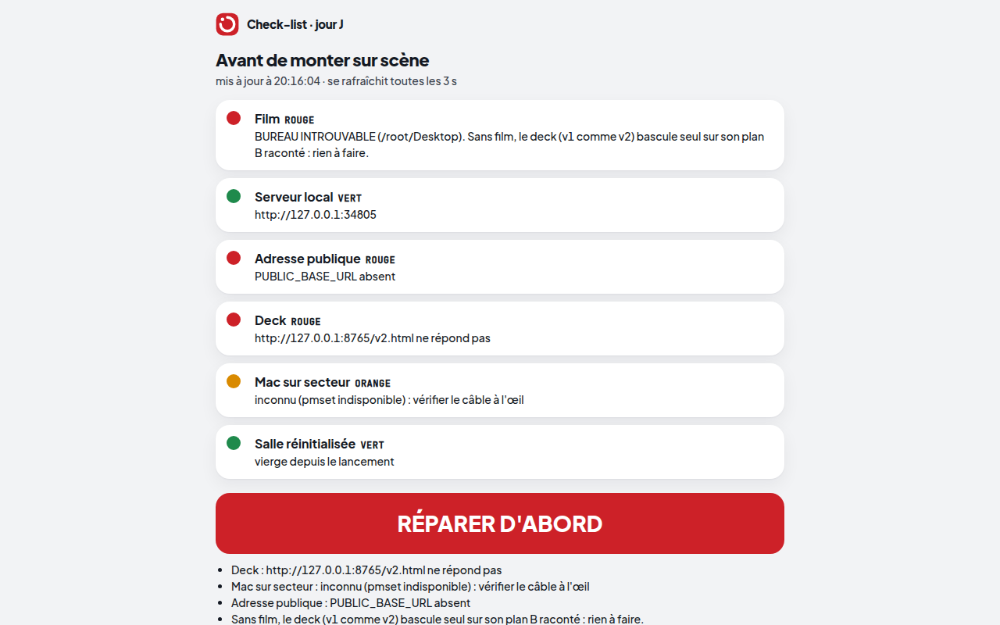

Six voyants et le verdict (« FEU VERT v2 », « RÉPARER D'ABORD », « PASSER EN v1 ») ; se met à jour toutes les 3 s.
Sur la capture, prise dans un conteneur de test, plusieurs voyants sont rouges : c'est attendu hors du Mac.

---

Régénérer : `cd prototype && python scripts/capturer_visite.py`.
